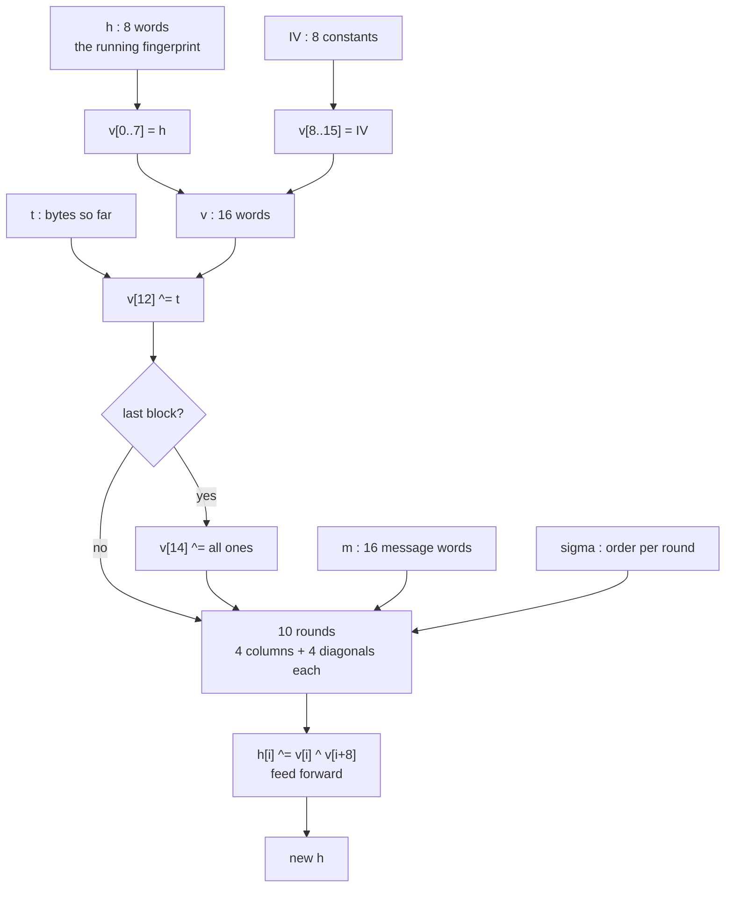
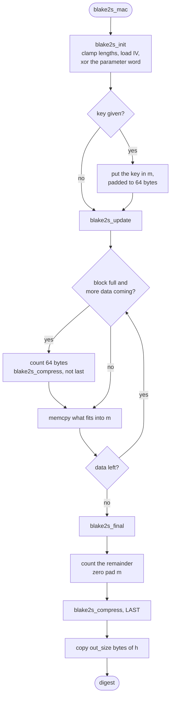
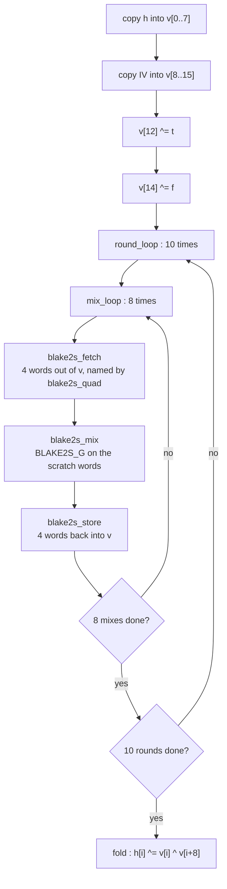

# BLAKE2s in TED

Reference documentation for the BLAKE2s implementation shared by **ted** (Oric
Atmos) and **ted64** (Commodore 64). The two repositories carry byte-identical
copies of `blake2s.s`, `blake2s_c.c` and `blake2s.h`; this document therefore
describes both.

TED uses BLAKE2s as a **message authentication code**. Every `.ted` file carries
a 16 byte tag computed over the whole file with a key derived from the password.
A text whose tag does not match has been damaged or opened with the wrong
password, and the editor says so before decrypting anything.

---

## Table of contents

1. [The algorithm](#1-the-algorithm)
2. [The implementation](#2-the-implementation)
3. [Reference, in alphabetical order](#3-reference-in-alphabetical-order)
4. [Bibliography](#4-bibliography)

---

## 1. The algorithm

### 1.1 What it is for

A **hash function** turns any amount of data into a short fingerprint. Change one
bit anywhere and the fingerprint changes completely and unpredictably.

A **message authentication code** is a hash with a key mixed in. Without the key
you cannot produce the right tag, so a tag proves two things at once: the data
has not been altered, and whoever produced the tag knew the key. That is exactly
what TED needs — a wrong password and a corrupted sector should both be caught,
and both are.

BLAKE2s has keying built in. There is no need for the HMAC construction that
older hashes require: you hand the key to the initialisation and hash normally.

### 1.2 Three operations and nothing else

BLAKE2s belongs to the **ARX** family — *Add, Rotate, Xor*. Every step of it is
one of three operations on 32 bit words:

| operation | notation | meaning |
| --- | --- | --- |
| addition | `a + b` | ordinary addition, discarding the carry out of bit 31 |
| exclusive or | `a ^ b` | bitwise, no carries |
| right rotation | `a >>> n` | bits pushed off the right come back on the left |

A rotation is not a shift: nothing is lost. Rotating `0x12345678` right by 8 gives
`0x78123456` — the byte that fell off the bottom reappears at the top.

This matters enormously on a 6502, which has no multiplier. The usual companion
of ChaCha20, **Poly1305**, is built on multiplication modulo 2¹³⁰−5 and would cost
several hundred cycles per byte in software multiplies alone. BLAKE2s costs
nothing the processor cannot already do. See [§2.3](#23-why-this-is-cheap-on-a-6502).

### 1.3 The pieces

| name | size | what it holds |
| --- | --- | --- |
| **h**, the chaining state | 8 words = 32 bytes | the running fingerprint |
| **m**, the message block | 16 words = 64 bytes | the chunk being absorbed |
| **v**, the working state | 16 words = 64 bytes | scratch, one compression's worth |
| **t**, the counter | 8 bytes (4 used here) | how many bytes have been fed in |
| **f**, the final flag | 1 word | all ones on the last block, zero otherwise |
| **IV** | 8 words | fixed constants, the same as SHA-256's |

Words are **little endian**: the word `0x12345678` is stored as the bytes
`78 56 34 12`. That is the processor's own order, which is one reason BLAKE2s is
comfortable here.

### 1.4 The mixing function G

`G` is the heart of the algorithm. It takes four words `a b c d` and two message
words `x y`, and stirs them together:

```
a = a + b + x
d = (d ^ a) >>> 16
c = c + d
b = (b ^ c) >>> 12
a = a + b + y
d = (d ^ a) >>> 8
c = c + d
b = (b ^ c) >>> 7
```

Read it as two halves that mirror each other. In each half, `a` absorbs `b` and a
message word; `d` is xored with the new `a` and rotated; `c` absorbs `d`; `b` is
xored with the new `c` and rotated. Every word ends up depending on every other,
and the rotations by 16, 12, 8 and 7 make sure the dependency reaches bits at
every position rather than staying aligned.

**Worked example.** The first `G` of the first round when hashing the empty
message, unkeyed, for a 32 byte digest — every message word is zero, so only the
mixing shows:

```
start    a=0x6B08E647  b=0x510E527F  c=0x6A09E667  d=0x510E527F
step 1   a=0xBC1738C6                              d=0x6AB9ED19
step 2                 b=0x1FF85CD8  c=0xD4C3D380
step 3   a=0xDC0F959E                              d=0x87B6B678
step 4                 b=0x408705AA  c=0x5C7A89F8
```

Four words that started with two of them equal come out with no visible relation
to each other. Eighty of these per block is what makes the output look random.

> **Where this lives:** [`BLAKE2S_G`](#blake2s_g), built from
> [`BLAKE2S_SUM32`](#blake2s_sum32), [`BLAKE2S_SUM32_M`](#blake2s_sum32_m),
> [`BLAKE2S_XOR32`](#blake2s_xor32) and the four rotation macros.

### 1.5 A round: columns, then diagonals

The sixteen words of `v` are read as a 4×4 square:

```
        v0   v1   v2   v3
        v4   v5   v6   v7
        v8   v9   v10  v11
        v12  v13  v14  v15
```

A **round** is eight applications of `G`. The first four take the **columns**:

```
G(v0,v4, v8,v12)   G(v1,v5, v9,v13)   G(v2,v6,v10,v14)   G(v3,v7,v11,v15)
```

The last four take the **diagonals**:

```
G(v0,v5,v10,v15)   G(v1,v6,v11,v12)   G(v2,v7, v8,v13)   G(v3,v4, v9,v14)
```

Columns spread each word down its own column; diagonals then carry it sideways.
After one round every word has touched every other. BLAKE2s runs **ten** rounds,
which is the safety margin.

> **Where this lives:** the table [`blake2s_quad`](#blake2s_quad) holds these
> eight quadruples, walked by [`blake2s_fetch`](#blake2s_fetch) and
> [`blake2s_store`](#blake2s_store).

### 1.6 Sigma: a different order every round

If every round folded the message words in the same order, the rounds would be
too similar to each other. BLAKE2s permutes them: round *r* uses the order given
by row *r* of the table **σ** (sigma). Row 0 is the identity `0 1 2 … 15`; row 1
is `14 10 4 8 9 15 13 6 1 12 0 2 11 7 5 3`; and so on for ten rows.

Each `G` consumes two entries, eight `G`s per round consume sixteen — exactly one
row. Ten rounds walk the whole table once, from beginning to end.

> **Where this lives:** [`blake2s_sigma`](#blake2s_sigma), walked by
> [`blake2s_sigma_index`](#blake2s_sigma_index).

### 1.7 The compression function

Compression takes the chaining state `h` and one block `m`, and produces a new
`h`:

1. **Fill the working state.** `v[0..7] = h[0..7]`, `v[8..15] = IV[0..7]`.
2. **Mix in the counter.** `v[12] ^= t` (low half), `v[13] ^= t >> 32` (high half).
   This is what makes the same block behave differently depending on where it sits
   in the message.
3. **Mix in the final flag.** `v[14] ^= f`, which is all ones on the last block
   only. This is what stops a message and a longer message beginning with it from
   colliding.
4. **Ten rounds** of eight `G`s, as above.
5. **Feed forward.** `h[i] = h[i] ^ v[i] ^ v[i+8]`.

Step 5 is what makes the function one-way: the two halves of `v` are folded back
into `h`, and nothing of the block survives except through that fold.



### 1.8 Keying, and the parameter block

The key is not hashed as data. Instead:

* The digest length, the key length, a fanout of 1 and a depth of 1 are packed
  into one 32 bit **parameter word** and xored into `h[0]`. Two hashes of the same
  message with different digest lengths are therefore unrelated — a 16 byte tag is
  not the first 16 bytes of the 32 byte one.
* If there is a key, it is padded with zeros to a **whole 64 byte block** and fed
  in as the first block of the message.

For TED: key length 32, digest length 16, giving the parameter word
`0x01010000 | (32 << 8) | 16`.

**Verifiable examples** (these are the values the implementation is tested
against, see [§2.6](#26-testing)):

```
empty message, unkeyed, 32 bytes   69217a3079908094e11121d042354a7c1f55b6482ca1a51e1b250dfd1ed0eef9
empty message, key 00..1f, 32 b    48a8997da407876b3d79c0d92325ad3b89cbb754d86ab71aee047ad345fd2c49
"abc",         key 00..1f, 16 b    61ba5f165c194692e09d12520cc4c74a
```

### 1.9 How TED uses it

Three keys are derived from the password, one per use, so that knowing one says
nothing about the others:

```
cipher key = BLAKE2s( key = password, "ted cipher key 2" )
tag key    = BLAKE2s( key = password, "ted tag key 2"    )
nonce key  = BLAKE2s( key = password, "ted nonce key 2"  )
```

The file tag is `BLAKE2s-128( key = tag key, everything in the file after the tag )`,
computed **after** encryption, so a wrong password is caught before anything is
decrypted. The nonce is `BLAKE2s-96( key = nonce key, entropy pool ‖ counters ‖
size ‖ line lengths )`. A text saved without a password is still tagged, with a
key of zeros: that detects damage and is not authentication, since anyone can
compute it.

---

## 2. The implementation

### 2.1 The split between C and assembly

| file | holds | why |
| --- | --- | --- |
| `blake2s.s` | the compression function | 80 `G`s per block; this is where all the time goes |
| `blake2s_c.c` | the buffering | gathering bytes into blocks; moving bytes, not mixing them |
| `blake2s.h` | the interface and the sizes | shared by both |

The dividing line is "does it mix or does it move?". Mixing is 32 bit arithmetic
that C compiles badly for a 6502; moving is `memcpy`, which the C library already
does well. Compression costs about 64 000 cycles per block, the buffering around
it a few hundred — so nothing is lost by leaving the bookkeeping in C, and a good
deal of readability is gained.

### 2.2 The flow of a hash



Inside `_blake2s_compress`:



**The one subtlety in the buffering.** A full block is *never* compressed as soon
as it is full. The last block is compressed differently — with the final flag set
— so a block that has just been filled waits until either more data arrives,
proving it was not the last, or the caller asks for the digest. That is why
[`blake2s_update`](#blake2s_update) tests `blake2s_rest == BLAKE2S_BLOCK_SZ` at the
*top* of its loop rather than after copying.

### 2.3 Why this is cheap on a 6502

**No multiplication.** The 6502 has no multiply instruction; a 16×16 multiply
costs 100+ cycles in software. BLAKE2s never needs one. Poly1305, the algorithm
one would normally pair with ChaCha20, is built entirely on them.

**Byte-aligned rotations are free.** A rotation by 8 or 16 bits does not shift
anything — it renames bytes. `0x12345678` is stored `78 56 34 12`; rotated right
by 8 it is stored `56 34 12 78`, the same bytes in a different order. So
[`BLAKE2S_ROTR8`](#blake2s_rotr8) and [`BLAKE2S_ROTR16`](#blake2s_rotr16) are pure
`lda`/`sta` moves, about 32 cycles each and no shifting at all. BLAKE2s uses
rotations of 16, 12, 8 and 7 — two of the four are free by this trick, and the
other two are built from it:

* [`BLAKE2S_ROTR12`](#blake2s_rotr12) = `ROTR8` then four single-bit rotations.
* [`BLAKE2S_ROTR7`](#blake2s_rotr7) = `ROTR8` then **one rotation back to the
  left**. Turning eight right and one left is far cheaper than turning seven
  right.

**The carry does the wrapping.** A single-bit rotation of a 32 bit value needs the
bit that falls off one end to reappear at the other.
[`BLAKE2S_ROTR1`](#blake2s_rotr1) gets this for free:

```asm
lda ADR         ; low byte
lsr a           ; carry now holds its lowest bit; A is discarded
ror ADR+3       ; that bit enters at the top, and bit 0 of ADR+3 leaves
ror ADR+2       ; ... and enters the next byte down
ror ADR+1
ror ADR
```

Five instructions, no temporary, no masking. The mirror image
[`BLAKE2S_ROTL1`](#blake2s_rotl1) needs one extra step, because `asl` leaves bit 0
clear rather than carrying a bit into it, so the bit that left the top is put back
with an `ora`.

**Pre-multiplied tables.** A word index has to become a byte offset, which means
multiplying by four. Rather than shifting twice at run time, eighty times per
block, both [`blake2s_sigma`](#blake2s_sigma) and [`blake2s_quad`](#blake2s_quad)
store their values **already multiplied by four**, computed by the assembler
through the [`BLAKE2S_SIGMA_ROW`](#blake2s_sigma_row) and
[`BLAKE2S_QUAD_ROW`](#blake2s_quad_row) macros. The tables are read straight into
an index register with `lda table,y`.

**Registers earn their keep.** `X` carries the message-word offset for
[`BLAKE2S_SUM32_M`](#blake2s_sum32_m), which reads `m` with `adc _blake2s_m,x` and
walks the four bytes with `inx`. `Y` walks the tables. Because the round loop
needs `Y` for the quad table between two mixes, how far sigma has been walked is
kept in memory ([`blake2s_sigma_index`](#blake2s_sigma_index)) and reloaded into
`Y` inside [`blake2s_mix`](#blake2s_mix) — two extra instructions per mix, in
exchange for not having to save and restore a register eighty times.

**The counter is 32 bits, not 64.** The specification gives `t` eight bytes.
TED's texts are at most about 15 kB, so the high half can never be anything but
zero and `v[13]` is left alone. This is a deliberate limitation, documented in
[`_blake2s_t`](#_blake2s_t): the implementation is correct for messages up to
4 GB, which is 250 000 times more than the editor can hold.

### 2.4 Size against speed: the choice that shaped the code

The eight mixes of a round could be written out one after the other, with the four
words of each named as literal addresses. That is how `chacha20.s` does it, and it
is about a third faster because nothing has to be fetched or put back.

It was measured and rejected: **written out, the round body costs about 5 kB**.
The Oric build had 803 bytes to spare at the time and the C64 build had 141. The
program has to leave room below the screen for 350 lines of text, and there was no
five kilobytes to be had.

So [`BLAKE2S_G`](#blake2s_g) is expanded **once**, inside
[`blake2s_mix`](#blake2s_mix), and called eighty times per block. Since the four
words it works on change from call to call, they are copied into four fixed
scratch words — [`blake2s_ga`](#blake2s_ga) … [`blake2s_gd`](#blake2s_gd) — by
[`blake2s_fetch`](#blake2s_fetch), and copied back by
[`blake2s_store`](#blake2s_store). That copying is the whole price of the
decision.

Measured under `sim65`, on 4096 bytes:

| variant | cycles/byte | code size |
| --- | --- | --- |
| `G` written out eighty times | 1101 | ≈ 5 kB |
| `G` called eighty times (**shipped**) | 1606 | 955 bytes |
| ChaCha20, for comparison | 1109 | 4529 bytes |

So authenticating a file costs about 45 % more than encrypting it, and a save that
was one pass over the text is now two. On a 350 line text that is roughly 23
seconds of tag on top of 16 seconds of cipher; on an ordinary note, a few seconds.

There is also a **rotation** trade hidden in the same place:
[`BLAKE2S_ROTR12`](#blake2s_rotr12) spends four single-bit rotations, about 120
cycles, and is the single most expensive step of `G`. A 256 byte nibble-swap table
would cut it to about 124 cycles — no gain worth 256 bytes. It was measured and
left alone.

### 2.5 Memory

`blake2s.s` reserves 184 bytes of BSS, `blake2s_c.c` adds 3 bytes of data:

```
_blake2s_h            32   chaining state          shared with C
_blake2s_m            64   block being gathered    shared with C
_blake2s_t             4   byte counter            shared with C
_blake2s_f             1   final flag              shared with C
blake2s_v             64   working state           private
blake2s_round          1   rounds left             private
blake2s_ga..gd        16   the four words in hand  private
blake2s_sigma_index    1   position in sigma       private
blake2s_quad_index     1   position in quad        private
                     ---
                     184
```

plus 224 bytes of read-only tables ([`_blake2s_iv`](#_blake2s_iv) 32,
[`blake2s_quad`](#blake2s_quad) 32, [`blake2s_sigma`](#blake2s_sigma) 160).

Only one hash can be in flight at a time — the state belongs to the module, not to
the caller — exactly as `chacha20.s` allows only one cipher at a time. TED never
needs two.

### 2.6 Testing

`blake2s.s` and `blake2s_c.c` are compiled for the `sim6502` target and run under
`sim65`, and their output is compared with Python's `hashlib.blake2s`:

* 11 message lengths — 0, 1, 2, 63, 64, 65, 127, 128, 129, 200, 300 — chosen to
  land either side of every block boundary, including the case of a message that
  is an exact multiple of the block size (where the "wait before compressing" rule
  is what makes the difference).
* each length unkeyed with a 32 byte digest, keyed with a 32 byte digest, and keyed
  with the 16 byte digest TED actually stores.
* one run feeding 200 bytes **one byte at a time**, which must give the same answer
  as feeding them in one call.

**34 of 34 digests match.** On top of that, a tag written by the Commodore 64 was
recomputed independently in Python — including the key derivation and the password
padding — and matched byte for byte, which is what guarantees the two machines can
read each other's files.

---

## 3. Reference, in alphabetical order

Symbols are listed in one alphabetical sequence regardless of which file they live
in. The **file** column says where to find each one.

Assembly names visible to C carry a leading underscore, which is the cc65 calling
convention: the C name `blake2s_h` is the assembly label `_blake2s_h`. Names
without the underscore are private to the assembly module.

### `_blake2s_compress`
**File:** `blake2s.s` · **Kind:** routine (`.proc`), exported to C as
`blake2s_compress`
Compresses the block in [`_blake2s_m`](#_blake2s_m) into the state in
[`_blake2s_h`](#_blake2s_h). The caller must already have filled the block, added
the byte count to [`_blake2s_t`](#_blake2s_t) and set [`_blake2s_f`](#_blake2s_f).
Fills [`blake2s_v`](#blake2s_v), mixes the counter and the flag in, runs ten
rounds through `round_loop`/`mix_loop`, then folds `v` back into `h`. Takes no
argument and returns nothing. About 64 000 cycles.

### `_blake2s_f`
**File:** `blake2s.s` · **Kind:** variable, 1 byte, exported
The final-block flag. `0x00` for an ordinary block, `0xFF` for the last one. It is
xored into all four bytes of `v[14]`, which is why one byte suffices to express a
32 bit value of all zeros or all ones. Set through
[`BLAKE2S_LAST`](#blake2s_last) / [`BLAKE2S_NOT_LAST`](#blake2s_not_last).

### `_blake2s_h`
**File:** `blake2s.s` · **Kind:** variable, 32 bytes, exported
The chaining state: eight little-endian 32 bit words holding the running
fingerprint. Initialised from [`_blake2s_iv`](#_blake2s_iv) by
[`blake2s_init`](#blake2s_init), which then xors the parameter word into its first
word. The digest is read from its first `out_size` bytes.

### `_blake2s_iv`
**File:** `blake2s.s` · **Kind:** table, 32 bytes read-only, exported
The eight initialisation constants, which are those of SHA-256 — the fractional
parts of the square roots of the first eight primes. Stored least significant byte
first. Read by [`blake2s_init`](#blake2s_init) for `h`, and by
[`_blake2s_compress`](#_blake2s_compress) for the upper half of `v`.

### `_blake2s_m`
**File:** `blake2s.s` · **Kind:** variable, 64 bytes, exported
The block being gathered and then compressed: sixteen little-endian words. Filled
by [`blake2s_update`](#blake2s_update), zero-padded by
[`blake2s_final`](#blake2s_final), read by [`BLAKE2S_SUM32_M`](#blake2s_sum32_m)
through the `X` register. Also serves as the buffer holding the padded key.

### `_blake2s_t`
**File:** `blake2s.s` · **Kind:** variable, 4 bytes, exported
The number of bytes fed in so far, xored into `v[12]`. The specification gives
this counter eight bytes; only the low four are kept, so the implementation is
correct for messages up to 4 GB. `v[13]`, which would carry the high half, is
never touched. Maintained by [`blake2s_count`](#blake2s_count).

### `blake2s_block`
**File:** `blake2s_c.c` · **Kind:** static function
`blake2s_block( uint8_t last )` — sets [`_blake2s_f`](#_blake2s_f) and calls
[`_blake2s_compress`](#_blake2s_compress). A two-line wrapper that exists so the
callers read as "compress this block, last or not" rather than as a flag store
followed by a call.

### `BLAKE2S_BLOCK_SZ`
**File:** `blake2s.s` and `blake2s.h` · **Kind:** constant = 64
The number of bytes the compression function eats at a time. Also the size to
which a key is padded.

### `blake2s_count`
**File:** `blake2s_c.c` · **Kind:** static function
`blake2s_count( uint16_t bytes )` — adds to the 32 bit counter
[`_blake2s_t`](#_blake2s_t), reached through a `uint32_t*`. The cast is safe
because the 6502 and cc65 agree on little-endian storage.

### `blake2s_fetch`
**File:** `blake2s.s` · **Kind:** routine (`.proc`), private
Copies the four words of the next mix out of [`blake2s_v`](#blake2s_v) into
[`blake2s_ga`](#blake2s_ga)…[`blake2s_gd`](#blake2s_gd). Reads which four from
[`blake2s_quad`](#blake2s_quad) at the offset in
[`blake2s_quad_index`](#blake2s_quad_index), through four expansions of
[`BLAKE2S_FETCH_WORD`](#blake2s_fetch_word). Roughly 144 cycles.

### `BLAKE2S_FETCH_WORD`
**File:** `blake2s.s` · **Kind:** macro, one argument
`BLAKE2S_FETCH_WORD ADR` — copies one word of `blake2s_v` into the scratch word at
`ADR`. Reads the word's byte offset from `blake2s_quad,y`, advances `Y` to the next
entry, then moves four bytes with `lda blake2s_v+n,x` / `sta ADR+n`.

### `blake2s_final`
**File:** `blake2s_c.c` · **Kind:** public function
`blake2s_final( uint8_t *out )` — counts the bytes still in the block, pads the
block with zeros, compresses it with the final flag set, and copies `out_size`
bytes of [`_blake2s_h`](#_blake2s_h) to `out`. Zero padding is unambiguous because
the byte count is mixed in as well. Leaves the module ready for a new
[`blake2s_init`](#blake2s_init).

### `BLAKE2S_FIRST_BIT`
**File:** `blake2s.s` · **Kind:** constant = 1
The lowest bit of a byte. Used by [`BLAKE2S_ROTL1`](#blake2s_rotl1) to put back the
bit that left the top of the word, into the position `asl` left clear.

### `BLAKE2S_G`
**File:** `blake2s.s` · **Kind:** macro, four arguments
`BLAKE2S_G ADR_A,ADR_B,ADR_C,ADR_D` — the mixing function of
[§1.4](#14-the-mixing-function-g), expanded exactly once in the program, inside
[`blake2s_mix`](#blake2s_mix). Built from [`BLAKE2S_SUM32`](#blake2s_sum32),
[`BLAKE2S_SUM32_M`](#blake2s_sum32_m), [`BLAKE2S_XOR32`](#blake2s_xor32),
[`BLAKE2S_ROTR16`](#blake2s_rotr16), [`BLAKE2S_ROTR12`](#blake2s_rotr12),
[`BLAKE2S_ROTR8`](#blake2s_rotr8) and [`BLAKE2S_ROTR7`](#blake2s_rotr7). Reads its
two message-word offsets from `blake2s_sigma,y`, advancing `Y` twice.

### `blake2s_ga`
**File:** `blake2s.s` · **Kind:** variable, 4 bytes, private
The word `a` of the mixing function of [§1.4](#14-the-mixing-function-g). The four
scratch words exist because [`BLAKE2S_G`](#blake2s_g) is expanded only once and
therefore needs fixed addresses to name, while the four words it operates on change
from mix to mix. Filled by [`blake2s_fetch`](#blake2s_fetch), emptied by
[`blake2s_store`](#blake2s_store).

### `blake2s_gb`
**File:** `blake2s.s` · **Kind:** variable, 4 bytes, private
The word `b` of the mixing function. See [`blake2s_ga`](#blake2s_ga).

### `blake2s_gc`
**File:** `blake2s.s` · **Kind:** variable, 4 bytes, private
The word `c` of the mixing function. See [`blake2s_ga`](#blake2s_ga).

### `blake2s_gd`
**File:** `blake2s.s` · **Kind:** variable, 4 bytes, private
The word `d` of the mixing function. See [`blake2s_ga`](#blake2s_ga).

### `BLAKE2S_HASH_SZ`
**File:** `blake2s.s` and `blake2s.h` · **Kind:** constant = 32
The size of the chaining state, and therefore of the longest digest.

### `blake2s_init`
**File:** `blake2s_c.c` · **Kind:** public function
`blake2s_init( const uint8_t *key, uint8_t key_size, uint8_t out_size )` — starts a
new hash. Clamps both lengths to
[`BLAKE2S_MAX_KEY_SZ`](#blake2s_max_key_sz) and
[`BLAKE2S_MAX_OUT_SZ`](#blake2s_max_out_sz), because both are later copied without
being measured; loads the IV; xors the parameter word into `h[0]`; clears the
counter; and, if a key was given, puts it zero-padded into
[`_blake2s_m`](#_blake2s_m) as the first block.

### `BLAKE2S_KEY_SZ`
**File:** `blake2s.h` · **Kind:** constant = 32
The key length TED uses. Passed by [`blake2s_mac`](#blake2s_mac); also the size of
each of the three keys derived from the password.

### `BLAKE2S_LAST`
**File:** `blake2s_c.c` · **Kind:** constant = `0xFF`
The value of [`_blake2s_f`](#_blake2s_f) on the last block.

### `BLAKE2S_LAST_BIT`
**File:** `blake2s.s` · **Kind:** constant = `$80` · **unused**
Defined but never referenced. See the [note on dead constants](#note-unused-constants).

### `blake2s_mac`
**File:** `blake2s_c.c` · **Kind:** public function
`blake2s_mac( const uint8_t *key, const uint8_t *data, uint16_t size, uint8_t *out,
uint8_t out_size )` — the whole tag of one contiguous buffer in a single call:
`init` with a [`BLAKE2S_KEY_SZ`](#blake2s_key_sz) key, one `update`, one `final`.
This is what TED calls for a file tag and for each derived key.

### `BLAKE2S_MAX_KEY_SZ`
**File:** `blake2s.h` · **Kind:** constant = 32
The longest key the specification allows. Used by
[`blake2s_init`](#blake2s_init) as a clamp, so that a caller asking for more cannot
write past [`_blake2s_m`](#_blake2s_m).

### `BLAKE2S_MAX_OUT_SZ`
**File:** `blake2s.h` · **Kind:** constant = 32
The longest digest the specification allows. Used by
[`blake2s_init`](#blake2s_init) as a clamp, so that a caller asking for more cannot
read past [`_blake2s_h`](#_blake2s_h).

### `blake2s_mix`
**File:** `blake2s.s` · **Kind:** routine (`.proc`), private
Runs [`BLAKE2S_G`](#blake2s_g) on the four scratch words. Loads `Y` from
[`blake2s_sigma_index`](#blake2s_sigma_index) on entry and writes it back on exit,
because the round loop needs `Y` for the quad table between two mixes. The single
most executed routine in the program: eighty calls per 64 byte block.

### `BLAKE2S_NB_MIXES`
**File:** `blake2s.s` · **Kind:** constant = 8
The number of mixing functions in one round: four columns and four diagonals. Used
with [`BLAKE2S_QUAD_SZ`](#blake2s_quad_sz) to size the quad table and to end
`mix_loop`.

### `BLAKE2S_NB_ROUNDS`
**File:** `blake2s.s` · **Kind:** constant = 10
The number of rounds of the compression function, and the number of rows of
[`blake2s_sigma`](#blake2s_sigma).

### `BLAKE2S_NOT_LAST`
**File:** `blake2s_c.c` · **Kind:** constant = `0x00`
The value of [`_blake2s_f`](#_blake2s_f) on an ordinary block.

### `blake2s_out_size`
**File:** `blake2s_c.c` · **Kind:** static variable
How many bytes of digest the caller asked for, remembered from
[`blake2s_init`](#blake2s_init) until [`blake2s_final`](#blake2s_final) copies
them out.

### `BLAKE2S_PARAM_DEP_SHIFT`, `BLAKE2S_PARAM_FAN_SHIFT`, `BLAKE2S_PARAM_KEY_SHIFT`
**File:** `blake2s_c.c` · **Kind:** constants = 24, 16, 8
Where the depth, the fanout and the key length sit inside the 32 bit parameter word
that [`blake2s_init`](#blake2s_init) xors into `h[0]`. The digest length occupies
the lowest byte and needs no shift.

### `BLAKE2S_PARAM_DEPTH`, `BLAKE2S_PARAM_FANOUT`
**File:** `blake2s.h` · **Kind:** constants = 1
The tree parameters of the specification. Both 1 means sequential hashing — one
leaf, one level — which is the only mode TED uses.

### `BLAKE2S_PARAM_OFFSET`
**File:** `blake2s_c.c` · **Kind:** constant = 0 · **unused**
Defined but never referenced. See the [note on dead constants](#note-unused-constants).

### `blake2s_quad`
**File:** `blake2s.s` · **Kind:** table, 32 bytes read-only, private
Which four words each of the eight mixes of a round works on: the four columns
then the four diagonals of the 4×4 square. Unlike the message order this never
changes from round to round, which is why it can be a table at all. Values are
**byte offsets**, already multiplied by [`BLAKE2S_WORD_SZ`](#blake2s_word_sz) by
[`BLAKE2S_QUAD_ROW`](#blake2s_quad_row).

### `blake2s_quad_index`
**File:** `blake2s.s` · **Kind:** variable, 1 byte, private
How far `mix_loop` has walked into [`blake2s_quad`](#blake2s_quad): 0, 4, 8 … 28.
Reset at the top of every round.

### `BLAKE2S_QUAD_ROW`
**File:** `blake2s.s` · **Kind:** macro, four arguments
`BLAKE2S_QUAD_ROW W0,W1,W2,W3` — emits one row of
[`blake2s_quad`](#blake2s_quad), multiplying each word index by
[`BLAKE2S_WORD_SZ`](#blake2s_word_sz) at assembly time. The parameters are named
`W0`…`W3` rather than `A`…`D` because `A` would collide with the accumulator.

### `BLAKE2S_QUAD_SZ`
**File:** `blake2s.s` · **Kind:** constant = 4
The number of words one mixing function works on.

### `blake2s_rest`
**File:** `blake2s_c.c` · **Kind:** static variable
How many bytes are waiting in [`_blake2s_m`](#_blake2s_m). Equal to
[`BLAKE2S_BLOCK_SZ`](#blake2s_block_sz) means the block is full but has not been
compressed, because it might still turn out to be the last one.

### `BLAKE2S_ROTL1`
**File:** `blake2s.s` · **Kind:** macro, one argument
One-bit **left** rotation of a 32 bit word. `asl` then three `rol`s move the bits;
the bit that left the top is put back at the bottom with an `ora` of
[`BLAKE2S_FIRST_BIT`](#blake2s_first_bit), because `asl` leaves that position
clear. Used only by [`BLAKE2S_ROTR7`](#blake2s_rotr7).

### `BLAKE2S_ROTR1`
**File:** `blake2s.s` · **Kind:** macro, one argument
One-bit right rotation. `lda`/`lsr` puts the lowest bit of the word into the carry
without storing anything, then four `ror`s walk it back in at the top. Five
instructions, no temporary. Used four times by
[`BLAKE2S_ROTR12`](#blake2s_rotr12).

### `BLAKE2S_ROTR12`
**File:** `blake2s.s` · **Kind:** macro, one argument
Twelve-bit right rotation: [`BLAKE2S_ROTR8`](#blake2s_rotr8) then four
[`BLAKE2S_ROTR1`](#blake2s_rotr1)s. At roughly 152 cycles this is the most
expensive single step of [`BLAKE2S_G`](#blake2s_g).

### `BLAKE2S_ROTR12_STEPS`
**File:** `blake2s.s` · **Kind:** constant = 4 · **unused**
Defined but never referenced — [`BLAKE2S_ROTR12`](#blake2s_rotr12) writes its four
rotations out literally. See the [note on dead constants](#note-unused-constants).

### `BLAKE2S_ROTR16`
**File:** `blake2s.s` · **Kind:** macro, one argument
Sixteen-bit right rotation: the two halves of the word are swapped. Rotating by
half the width is the same turn in either direction, so this is exactly the
rotation `chacha20.s` performs under its own name.

### `BLAKE2S_ROTR7`
**File:** `blake2s.s` · **Kind:** macro, one argument
Seven-bit right rotation, done as [`BLAKE2S_ROTR8`](#blake2s_rotr8) followed by
[`BLAKE2S_ROTL1`](#blake2s_rotl1) — one byte right, one bit back left. Much
cheaper than seven single-bit rotations.

### `BLAKE2S_ROTR8`
**File:** `blake2s.s` · **Kind:** macro, one argument
Eight-bit right rotation: a pure byte move. The low byte is saved in `X`, the
other three walk down one position, and the saved byte becomes the high one.
Nothing is shifted.

### `blake2s_round`
**File:** `blake2s.s` · **Kind:** variable, 1 byte, private
How many rounds are left to run, counted down from
[`BLAKE2S_NB_ROUNDS`](#blake2s_nb_rounds) by `round_loop`.

### `blake2s_sigma`
**File:** `blake2s.s` · **Kind:** table, 160 bytes read-only, private
The permutation table of [§1.6](#16-sigma-a-different-order-every-round): ten rows
of sixteen message-word indices, one row per round. Values are **byte offsets**,
already multiplied by [`BLAKE2S_WORD_SZ`](#blake2s_word_sz) by
[`BLAKE2S_SIGMA_ROW`](#blake2s_sigma_row). Walked from beginning to end exactly
once per compression.

### `blake2s_sigma_index`
**File:** `blake2s.s` · **Kind:** variable, 1 byte, private
How far [`blake2s_sigma`](#blake2s_sigma) has been walked, 0 to 160. Held in
memory rather than in `Y` because the round loop needs `Y` for
[`blake2s_quad`](#blake2s_quad) between two mixes;
[`blake2s_mix`](#blake2s_mix) loads and saves it around each mix.

### `BLAKE2S_SIGMA_ROW`
**File:** `blake2s.s` · **Kind:** macro, sixteen arguments
`BLAKE2S_SIGMA_ROW S0..SF` — emits one row of
[`blake2s_sigma`](#blake2s_sigma), multiplying each index by
[`BLAKE2S_WORD_SZ`](#blake2s_word_sz) at assembly time.

### `BLAKE2S_SIGMA_SZ`
**File:** `blake2s.s` · **Kind:** constant = 16
The number of message indices one round uses. Used in the assertion that checks
the permutation table came out the right size.

### `blake2s_store`
**File:** `blake2s.s` · **Kind:** routine (`.proc`), private
The mirror of [`blake2s_fetch`](#blake2s_fetch): copies the four scratch words back
into [`blake2s_v`](#blake2s_v), through four expansions of
[`BLAKE2S_STORE_WORD`](#blake2s_store_word).

### `BLAKE2S_STORE_WORD`
**File:** `blake2s.s` · **Kind:** macro, one argument
`BLAKE2S_STORE_WORD ADR` — copies one scratch word back into `blake2s_v` at the
offset named by the next entry of [`blake2s_quad`](#blake2s_quad), advancing `Y`.

### `BLAKE2S_SUM32`
**File:** `blake2s.s` · **Kind:** macro, two arguments
`BLAKE2S_SUM32 ADR_X,ADR_Y` — 32 bit addition `X = X + Y`, both at absolute
addresses. `clc` once, then four `lda`/`adc`/`sta` groups letting the carry ripple
up. Identical to the addition of `chacha20.s`.

### `BLAKE2S_SUM32_M`
**File:** `blake2s.s` · **Kind:** macro, one argument
`BLAKE2S_SUM32_M ADR_X` — 32 bit addition of a **message word** to the value at
`ADR_X`. The message word changes from round to round, so it is reached through the
`X` register with `adc _blake2s_m,x` and `inx` between bytes. `X` must be loaded
from [`blake2s_sigma`](#blake2s_sigma) beforehand and is left pointing at the last
byte read.

### `BLAKE2S_TAG_SZ`
**File:** `blake2s.h` · **Kind:** constant = 16
The digest length TED stores in a file — 128 bits. A forgery has to be found by
trying, and one chance in 2¹²⁸ is out of reach of anything, while sixteen bytes in
every file header is a cost paid on every save. Referenced from `textstore.h` as
`TEXTSTORE_TAG_SZ`.

### `blake2s_update`
**File:** `blake2s_c.c` · **Kind:** public function
`blake2s_update( const uint8_t *data, uint16_t size )` — feeds data in, a block at
a time. Compresses a full block only when more data proves it was not the last;
see the note at the end of [§2.2](#22-the-flow-of-a-hash). May be called any number
of times with any sizes, including one byte at a time, and gives the same answer as
a single call.

### `blake2s_v`
**File:** `blake2s.s` · **Kind:** variable, 64 bytes, private
The working state of one compression: sixteen words, the lower eight copied from
[`_blake2s_h`](#_blake2s_h) and the upper eight from
[`_blake2s_iv`](#_blake2s_iv). Everything the ten rounds do happens here, and at
the end both halves are folded back into `h`.

### `BLAKE2S_WORD_SZ`
**File:** `blake2s.s` · **Kind:** constant = 4
The size of a word in bytes. Also the factor by which the two tables are
pre-multiplied, so that their entries are byte offsets.

### `BLAKE2S_XOR32`
**File:** `blake2s.s` · **Kind:** macro, two arguments
`BLAKE2S_XOR32 ADR_X,ADR_Y` — 32 bit exclusive or `X = X ^ Y`. Four `lda`/`eor`/
`sta` groups; no carry, so no `clc`.

### `V0` … `V15`
**File:** `blake2s.s` · **Kind:** constants
The addresses of the sixteen words of [`blake2s_v`](#blake2s_v), each defined as
`blake2s_v + n * BLAKE2S_WORD_SZ`. Only `V12` and `V14` are used, by
[`_blake2s_compress`](#_blake2s_compress) when it mixes in the counter and the
final flag; the rest are reached through [`blake2s_quad`](#blake2s_quad) at run
time. They are all defined for symmetry and because they document the layout.

### Local labels
`copy_state`, `copy_iv`, `fold`, `round_loop`, `mix_loop` inside
[`_blake2s_compress`](#_blake2s_compress), and `end_rot` inside
[`BLAKE2S_ROTL1`](#blake2s_rotl1). The last is declared `.local` so that the macro
can be expanded more than once.

### Note: unused constants
[`BLAKE2S_LAST_BIT`](#blake2s_last_bit),
[`BLAKE2S_PARAM_OFFSET`](#blake2s_param_offset) and
[`BLAKE2S_ROTR12_STEPS`](#blake2s_rotr12_steps) are defined but never referenced.
They are harmless — the assembler and the compiler emit nothing for them — but they
are dead and could be removed.

---

## 4. Bibliography

**The specification**

* RFC 7693, *The BLAKE2 Cryptographic Hash and Message Authentication Code (MAC)*,
  M-J. Saarinen and J-P. Aumasson, November 2015.
  <https://www.rfc-editor.org/rfc/rfc7693> — the normative reference, with the
  pseudocode this implementation follows, the sigma table and the test vectors.

* J-P. Aumasson, S. Neves, Z. Wilcox-O'Hearn, C. Winnerlein, *BLAKE2: simpler,
  smaller, fast as MD5*, 2013. <https://www.blake2.net/blake2.pdf> — the design
  paper: why ten rounds, why these rotations, and the reasoning behind the
  parameter block.

* <https://www.blake2.net/> — the project page, with the reference implementations
  in C and the full known-answer test files.

* <https://github.com/BLAKE2/BLAKE2> — the reference source, including
  `blake2s-kat.txt`, the keyed known-answer tests.

**Where the constants come from**

* FIPS 180-4, *Secure Hash Standard*, NIST, 2015.
  <https://csrc.nist.gov/publications/detail/fips/180-4/final> — BLAKE2s reuses the
  SHA-256 initialisation vector, defined in §5.3.3.

**The relatives**

* D. J. Bernstein, *ChaCha, a variant of Salsa20*, 2008.
  <https://cr.yp.to/chacha/chacha-20080128.pdf> — the quarter round that BLAKE2s's
  `G` is built from, and the cipher TED already carries in `chacha20.s`.

* RFC 8439, *ChaCha20 and Poly1305 for IETF Protocols*, Y. Nir and A. Langley,
  June 2018. <https://www.rfc-editor.org/rfc/rfc8439> — the AEAD construction TED
  deliberately does *not* use, because Poly1305 needs multiplication. See
  [§2.3](#23-why-this-is-cheap-on-a-6502).

* D. J. Bernstein, *The Poly1305-AES message-authentication code*, 2005.
  <https://cr.yp.to/mac/poly1305-20050329.pdf> — for the comparison.

**Tools**

* cc65 documentation. <https://cc65.github.io/doc/> — in particular `ca65` for the
  macro and segment directives used here, and `sim65`, the simulator the test
  vectors are run under.

* Python `hashlib.blake2s`. <https://docs.python.org/3/library/hashlib.html> — the
  independent implementation this code is checked against.

**Background reading**

* J. Katz and Y. Lindell, *Introduction to Modern Cryptography*, 3rd edition, CRC
  Press, 2020 — chapters 4 and 5 for what a MAC is and why encrypt-then-MAC is the
  right order.

* M-J. Saarinen, *BLAKE2 known-answer tests and reference vectors*, in RFC 7693
  Appendix A and B — the worked example of a full compression, useful when
  debugging an implementation one round at a time.
